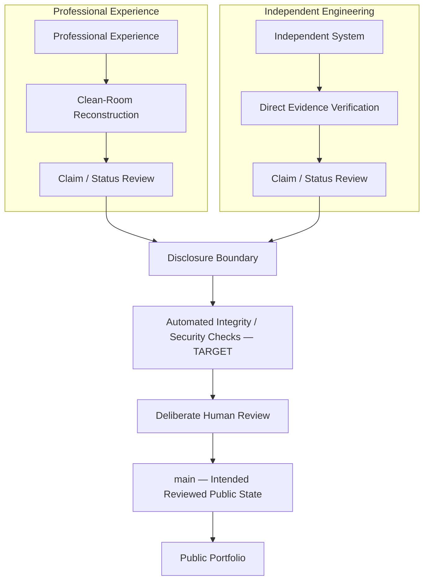

# Portfolio Architecture and Governance

The portfolio is a governed evidence system, not simply a collection of project pages.

Its architecture is an information and governance model: it separates evidence by provenance, defines what may cross into public view, and describes how claims become part of the intended reviewed public state. It is not software architecture, and the documents in this repository are not represented as services or runtime components.

The repository-wide publication policy is defined in [DISCLOSURE.md](DISCLOSURE.md). The clean-room boundary for professional work is recorded in [ADR 0001](docs/decisions/0001-clean-room-evidence-boundary.md).

## Content Domains

| Domain | Responsibility |
| --- | --- |
| `README.md` | Public front door and navigation into the portfolio. |
| `professional-methodologies/` | Clean-room representations of professional engineering experience using generalized methodology, synthetic examples, and independently recreated diagrams. Employer and client artifacts do not belong here. |
| `independent-projects/` | Systems independently owned and built by Robin. These may provide deeper technical evidence when disclosure-safe, but implementation claims remain bounded by verified evidence. |
| `capability-highlights/` | Supporting capabilities, experiments, and engineering approaches. Each page must identify whether its evidence path is professional, independent, or mixed. |
| `frameworks/` | Reusable governance and engineering templates for decisions, validation, disclosure review, and case studies. |
| `docs/decisions/` | Accepted repository decisions that exercise the decision framework. |
| `assets/` | Intentionally published visual or binary material subject to provenance, disclosure, metadata, and size review. |
| `DISCLOSURE.md` | Repository-wide publication policy and disclosure boundary. |

## Evidence Paths

Professional and independent work reach the public portfolio through different evidence paths. They converge only after provenance, claim status, and disclosure have been reviewed.



Automated checks can support repository integrity, secret detection, link validation, formatting, and similar deterministic checks. They cannot determine whether a professional claim is truthful, material is employer-confidential, intellectual property is safe to disclose, or ownership language is accurate. Those decisions remain human review boundaries.

## Trust Boundaries

### Boundary 1 — Professional to Public

Professional experience does not cross directly into the repository. Employer and client artifacts are not sanitized and republished. Public professional evidence must be independently reconstructed from generalized methodology, synthetic material, fictional entities, independently authored diagrams, and public concepts.

### Boundary 2 — Independent System to Public

Independent work may provide deeper evidence because Robin owns the underlying work. Only verified, disclosure-safe implementation may be represented as implemented. Designed, experimental, and planned capabilities remain explicitly separated.

### Boundary 3 — Draft or Feature Branch to `main`

Feature branches are working state. `main` is intended to represent reviewed public state.

- **Current:** this repository uses feature branches and deliberate review, but GitHub-hosted pull-request and required-check enforcement is not configured.
- **Target:** hosted rules will enforce pull requests and stable validation checks after the validation automation has been implemented and proven reliable.

## Governance Principles

1. **Expose the decision. Protect the implementation.**
2. **Evidence over assertion.** Evidence should be scoped, current, and appropriate to the claim.
3. **Professional experience crosses a clean-room boundary.**
4. **Independent work may provide deeper evidence where safe.**
5. **When a claim depends on unavailable evidence, narrow or withhold the claim.**
6. **Governance should be proportional to consequence.**
7. **Automated checks support human judgment; they do not replace it.**
8. **`main` represents the intended reviewed public state.**
9. **Templates are useful when exercised.**
10. **Material control failures and degraded states should be observable; when authority depends on missing evidence, behavior should fail safely.**

## Content Admission Flow

The intended lifecycle is:

```text
Change Intent
      ↓
Feature Branch
      ↓
Identify Evidence Path
      ↓
Create or Modify Content
      ↓
Claim Review
      ↓
Disclosure Review
      ↓
Automated Validation [TARGET]
      ↓
Pull Request [TARGET: hosted enforcement not configured]
      ↓
Deliberate Owner Review
      ↓
main
```

Claim and disclosure review are required human decisions for substantive material. Automated validation and hosted pull-request enforcement are target controls and must not be treated as implemented until they exist and operate reliably.

## Failure Model

| Failure | Prevent | Detect | Respond |
| --- | --- | --- | --- |
| Employer or client artifact exposure | Clean-room boundary; independently create public evidence | Provenance and disclosure review | Stop publication, contain the material, assess Git history, and remove or remediate appropriately |
| Secret or credential exposure | Keep private configuration outside the repository; use minimum-necessary evidence | Secret scanning and human review | Revoke first, assess exposure, and remove the material from current and historical states as necessary |
| Unsupported claim | Require scoped ownership, status, and evidence | Claim review against available evidence | Narrow, relabel, or remove the claim |
| Professional work misclassified as independent | Separate evidence paths and require ownership metadata | Disclosure and ownership review | Correct the classification and reassess dependent claims |
| Broken public artifact or navigation | Use stable relative paths and validate Markdown and diagrams | Link, structure, and rendering checks | Repair before material enters the reviewed public state |
| Accidental local or generated file | Narrow ignore rules and intentional asset review | Staged-file and repository-hygiene checks | Remove the file and refine prevention when warranted |
| Bypass of reviewed-`main` process | Use feature branches and target hosted enforcement | Git history and hosted audit evidence | Revert or review through the normal path and document any necessary exception |

## Reassessment

Reassess this architecture and its governance when:

- a new evidence type is introduced;
- a new binary or media format is published;
- substantive claim categories change;
- automation gains additional authority;
- GitHub-hosted controls materially change; or
- a disclosure or security failure occurs.
