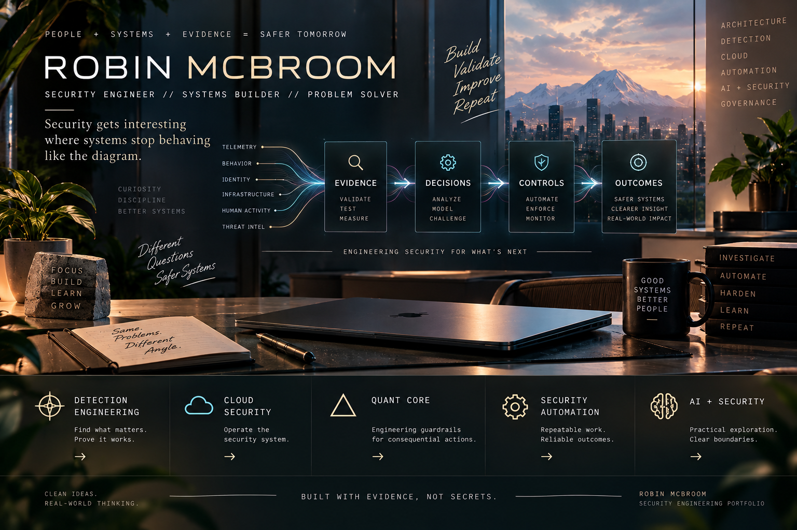

# Robin McBroom

**Security gets interesting where systems stop behaving like the diagram.**

I turn ambiguous, high-consequence security problems into systems people can reason about, test, and operate.

- Detection engineering and data protection / insider risk
- AWS / GCP security infrastructure and operational troubleshooting
- Security automation, telemetry, and integrations

---

## Start here

**I want to see…**

- [how Robin engineers detections →](professional-methodologies/detection-engineering-validation/README.md)
- [whether she actually knows cloud infrastructure →](professional-methodologies/cloud-security-infrastructure/README.md)
- [something she designed and built independently →](independent-projects/quant-core/README.md)
- [how she thinks about security automation →](capability-highlights/security-automation-tooling.md)
- [a grounded take on AI + security →](capability-highlights/ai-assisted-security-engineering.md)

## Featured engineering stories

### ◇ Detection Engineering — when is a detection trustworthy?

`[ CLEAN ROOM ]` Start with the behavior. Verify the telemetry. Test the negative cases. Measure before tuning. Operate the result as a security control.

[Explore the detection workbench →](professional-methodologies/detection-engineering-validation/README.md)

### ◆ Cloud Security — who operates the security system?

`[ CLEAN ROOM ]` AWS and GCP infrastructure, machine identity, telemetry, scanners, integrations, upgrades, and the dependency chain behind a healthy control.

[Trace the system →](professional-methodologies/cloud-security-infrastructure/README.md)

### △ Quant Core — what changes when automation can act?

`[ VERIFIED ]` An independent build examining risk gates, persistent evidence, external state, architectural boundaries, and where the current guarantees stop.

[Inspect the build →](independent-projects/quant-core/README.md)

## Notes from the lab wall

- **UNKNOWN ≠ SAFE** — missing evidence should reduce authority, not create permission.
- **INTENT IS NOT EXECUTION** — a decision, an attempt, and a confirmed result are different facts.
- **A VALID QUERY CANNOT COMPENSATE FOR MISSING EVIDENCE.**
- **THE MODEL IS NOT THE SECURITY BOUNDARY.**

## From the workbench

- [Security Automation & Tooling](capability-highlights/security-automation-tooling.md) — automate the deterministic work; keep consequential judgment accountable.
- [AI-Assisted Security Engineering](capability-highlights/ai-assisted-security-engineering.md) — evidence, tool authority, human approval, and the limits of experimental systems.

## Built with evidence, not secrets

Professional work is represented through independently authored clean-room models and synthetic examples. Employer artifacts and security-sensitive implementation details stay private. [Read the disclosure policy →](DISCLOSURE.md)

Reusable [decision](frameworks/architecture-decision-record.md), [validation](frameworks/validation-plan.md), and [review](frameworks/disclosure-review.md) frameworks sit behind the work.
