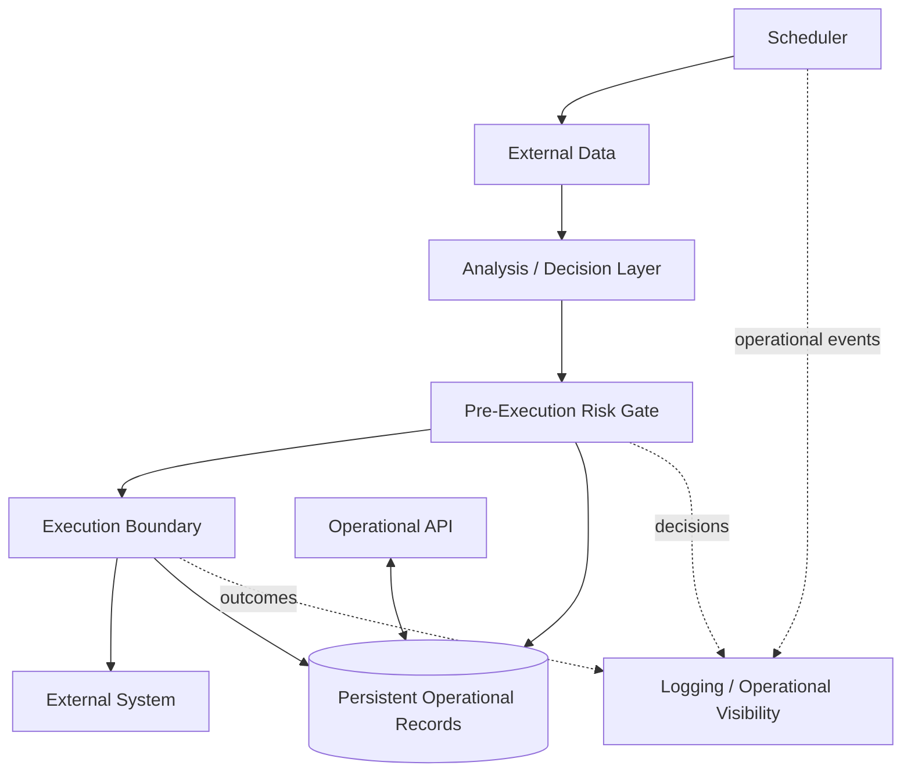
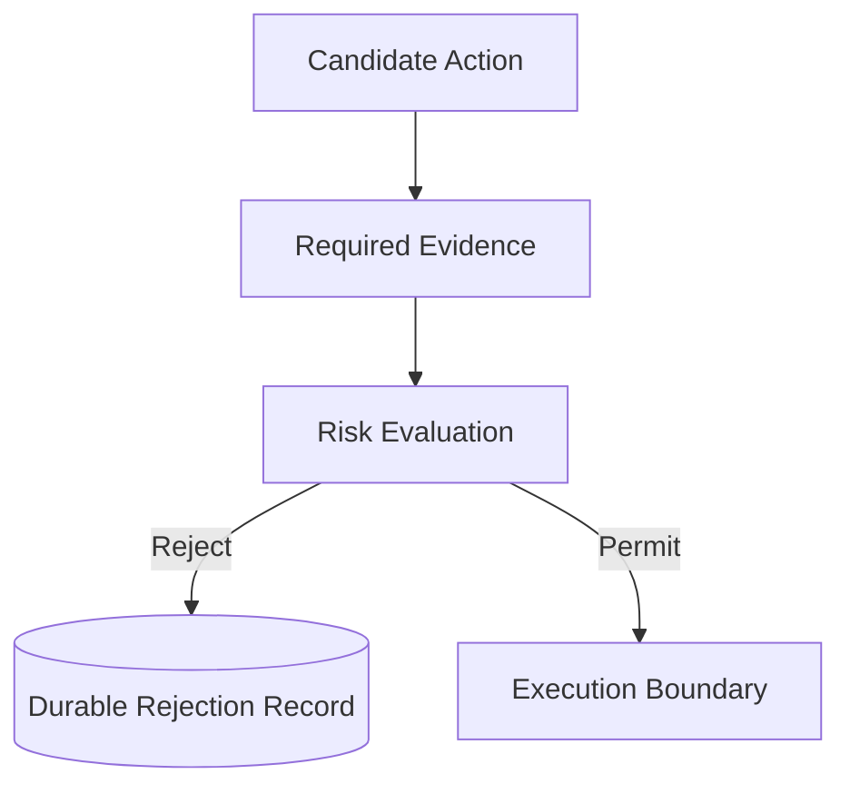
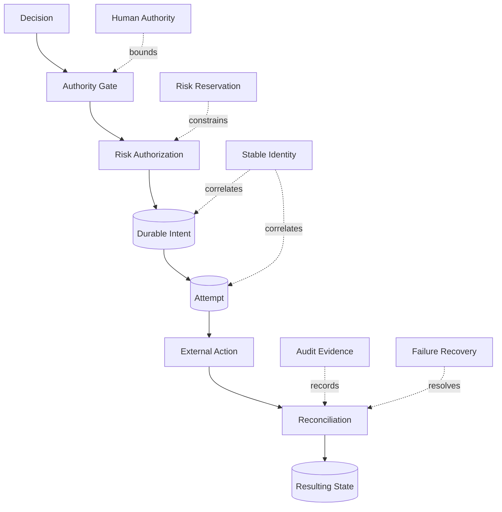

# Quant Core — Engineering Guardrails for an Automated Decision System

> An independently engineered system exploring modular automation, pre-execution risk controls, operational state, and architectural validation around consequential external actions.

> **Ownership:** Independent  
> **Implementation Status:** Implemented current system / Designed hardening direction not implemented  
> **Disclosure:** Showcase architecture / Private implementation and strategy  
> **Evidence:** Verified implementation / Independently recreated public diagrams  
> **Last Verified:** 2026-09-21 at `d7fc69fd68bfb2592e6fbccbc4ce44d462d846b0`

## Build brief // read this first

> **The question:** How should an automated system be structured when a wrong external action can have real consequences?

- **Built independently:** a modular Python system with scheduled responsibilities, external adapters, a pre-execution risk gate, persistent operational records, and an operational API.
- **Verified:** 78 unit tests and six architecture tests passed at the evidence revision; no integration tests were present.
- **Engineering stance:** missing required evidence blocks the proposed action in the verified balance-evidence path.
- **Current boundary:** durable intent, stable retry identity, reconciliation, atomic risk reservation, and authoritative pause enforcement are not implemented.

`[ IMPLEMENTED / VERIFIED ]` and `[ DESIGNED — NOT IMPLEMENTED ]` remain separate throughout the page.

[See the current architecture](#current-architecture) · [Find the assurance limits](#architecture-review--where-the-guarantees-stop) · [Compare the designed direction](#designed-hardening-direction)

## Problem

Automated systems often combine external data, decision logic, risk evaluation, scheduled execution, persistent state, and external APIs. The engineering problem is not simply whether the system can automate an action. It is how to constrain, validate, observe, and reason about that automation when an incorrect action can have real consequences.

Quant Core is a personal engineering project I use to examine that problem in a financial external-action domain. This case study concerns system boundaries and engineering controls. It makes no claim about investment performance, profitability, live-operation success, or production readiness.

## Why It Matters

The same concerns appear across security automation, response orchestration, infrastructure control, and other systems with consequential side effects:

- authority should be bounded before an external action occurs;
- missing evidence needs an explicit failure behavior;
- decision, authorization, and execution are different responsibilities;
- external systems introduce uncertainty that local state cannot eliminate;
- operational records need to support investigation and review; and
- structural tests can protect intended boundaries while still leaving runtime guarantees to be proven separately.

The domain supplies the consequence model. The transferable engineering question is how to keep automation understandable and constrained.

## Ownership

**Ownership: Independent.** I own the architecture and implementation of this personal engineering project. AI-assisted development tools may have been used during development; architectural acceptance, engineering decisions, and responsibility for the resulting system remain mine. No employer implementation or employer artifact is represented here.

## Current Architecture

**Status: IMPLEMENTED / VERIFIED**

This diagram is a new, disclosure-safe representation of verified responsibilities and relationships. It is not copied from private project documentation and does not show provider-specific integrations or decision logic.

The implementation separates scheduled market-data, analysis, risk, and execution responsibilities. External interactions are placed behind adapters, while PostgreSQL-backed records retain selected trade, rejection, report, and operational-state information. A FastAPI interface exposes operational functions, and logging provides runtime visibility.

## Key Engineering Decisions

| Decision | Why it mattered | Tradeoff or consequence | Status |
| --- | --- | --- | --- |
| Separate analysis from risk evaluation | A candidate decision should not authorize itself | The boundary is only as strong as the paths that consistently use it | Implemented |
| Place risk evaluation before execution | Consequential actions should be evaluated before reaching an external adapter | This is pre-execution gating, not an atomic reservation of capacity | Implemented |
| Isolate external interactions behind adapters | External APIs introduce provider behavior and failure modes that should not spread through decision logic | Adapter isolation does not itself provide reconciliation or idempotency | Implemented |
| Persist selected operational records | Decisions, rejections, reports, and state need durable operational evidence | Persistence after an action is not the same as durable intent before it | Implemented |
| Control scheduled-run overlap and missed runs | Re-entrant or stale scheduled work can create conflicting activity | Scheduler controls do not provide duplicate-execution protection across every failure mode | Implemented |
| Default configurable integrations toward simulation or practice modes | Development should avoid assuming live authority | These are configuration defaults, not immutable safety enforcement | Implemented |
| Enforce modular package dependencies with tests | Architectural boundaries should be executable expectations | Static structure does not prove runtime call order or complete safety | Implemented |

## Pre-Execution Risk Gate

**Status: IMPLEMENTED / VERIFIED at a sanitized conceptual level**

The risk layer evaluates proposed actions before they reach an external adapter. Several rejection conditions are covered by unit tests. Public documentation intentionally omits the rules, thresholds, sizing behavior, formulas, and strategy context that determine a specific result.

This mechanism is accurately described as **pre-execution risk gating**. It is not a risk reservation system and does not claim atomic portfolio-wide exposure control.

## Fail-Closed Example

**UNKNOWN ≠ SAFE**

One verified behavior concerns evidence needed for a consequential decision. When the required external balance evidence cannot be obtained, the system blocks the proposed action rather than treating missing evidence as permission to continue.

This is a narrow but important fail-closed property: absence of critical evidence reduces the system's authority. It does not establish that every external error or unknown state is handled with the same guarantee.

## Architectural Validation

**Status: IMPLEMENTED / VERIFIED**

At the evidence SHA, six architecture tests pass. They enforce selected structural expectations, including modular dependency boundaries, configuration coverage, and security-oriented code-structure checks.

These tests are useful because architectural intent becomes reviewable and executable rather than existing only in prose. Their limit is equally important: they do not prove runtime call order, end-to-end recovery, external-system consistency, or complete system safety.

## Testing Evidence

Verified on 2026-09-21 at `d7fc69fd68bfb2592e6fbccbc4ce44d462d846b0`:

| Test category | Count | Result |
| --- | ---: | --- |
| Unit tests | 78 | Passing |
| Architecture tests | 6 | Passing |
| Integration tests | 0 | Not currently present |
| **Total verified** | **84** | **Passing** |

The public evidence reports only aggregate results. Test names, fixtures, strategy-sensitive scenarios, and private implementation details remain excluded.

## Operational Concerns

**Status: IMPLEMENTED, within the limits stated below**

- Scheduled execution includes controls for overlapping work and missed runs.
- Selected operational events and state are persisted in PostgreSQL.
- External API behavior is isolated behind adapter boundaries.
- Simulation or practice behavior is configurable and used as the default posture for supported integrations.
- Logging provides operational visibility.
- A FastAPI interface exposes operational capabilities.
- Docker and CI configurations are present.

Configuration defaults should not be confused with non-bypassable authority controls. Likewise, persistent records support observability but do not independently guarantee recovery, reconciliation, or exactly-once external effects.

## Authority and Governance Boundaries

**Status: PARTIALLY IMPLEMENTED / LIMITS EXPLICIT**

The current system expresses governance primarily through code boundaries: candidate actions pass through a risk gate, selected decisions and outcomes leave operational records, and architecture tests check designated dependency rules. These mechanisms make some authority and structural expectations reviewable.

The verified implementation does not include formal ADR governance, a universal human-approval boundary, or an authoritative emergency-pause control enforced across the execution path. Those stronger controls remain review findings or future-state design concepts, not current capabilities.

## Architecture Review — Where the Guarantees Stop

**Status: REVIEW FINDINGS / NOT REMEDIATED IN THE VERIFIED IMPLEMENTATION**

A clean-room portfolio review of the implementation identified areas where a higher-assurance system would require stronger guarantees:

- External side effects currently precede durable intent recording.
- There is no first-class reconciliation subsystem or startup reconciliation process.
- Risk checks do not reserve capacity atomically.
- Stored pause state is not enforced as an authoritative execution-path control.
- Restart and recovery behavior is not covered by integration tests.
- External protective state is not comprehensively verified.
- Stable retry identity and general duplicate-execution protection are not established.

These are not presented as completed fixes. They define the boundary of the evidence. Building the system was one engineering exercise; reviewing where its guarantees stop is another.

## Designed Hardening Direction

> **DESIGNED — NOT IMPLEMENTED**

The following is an independent future-state design exercise. It describes stronger assurance properties that the verified Quant Core implementation does not currently provide.

The design separates a decision from permission to act, records durable intent before an external side effect, correlates attempts with stable identity, reserves risk capacity transactionally, and reconciles local beliefs with external truth. Audit evidence, recovery behavior, and human authority surround the lifecycle rather than being added after execution.

No part of this diagram should be interpreted as a claim that the current implementation contains durable intent, stable retry identity, risk reservation, reconciliation, or authoritative human pause enforcement.

## Key Design Principles

> **Unknown external state should reduce system authority, not increase it.**

When critical truth is unavailable, continuing as though the state were safe turns uncertainty into permission. A higher-assurance design should narrow or suspend authority until the uncertainty is resolved.

> **Intent is not execution.**

A local decision to act, an authorization to act, an attempt to act, and an externally confirmed result are different facts. Treating them as one event hides ambiguous failures and weakens recovery reasoning.

## What I Learned

- Successful automation is not equivalent to safe automation.
- Persistence after an external action is not equivalent to durable intent before it.
- External systems create ambiguous failure states that local control flow cannot fully resolve.
- Risk checks and risk reservations solve different problems.
- Architecture tests protect selected structures; they do not create runtime guarantees.
- Missing evidence should not silently become permission.
- Authority should decrease when critical truth is unavailable.
- A useful architecture review states both what the system does and where its guarantees end.

<strong>Evidence map // built, designed, private</strong>

## Evidence and Disclosure Classification

### IMPLEMENTED / VERIFIED

- Independently developed modular Python implementation
- Pre-execution risk gate with multiple unit-tested rejection conditions
- Fail-closed behavior for unavailable required balance evidence
- PostgreSQL-backed operational records
- External-system adapters
- Scheduler overlap and missed-run controls
- Configurable simulation or practice defaults
- FastAPI operational interface
- Docker and CI configuration
- Six architecture tests and 78 unit tests passing at the stated evidence SHA

### DESIGNED / NOT IMPLEMENTED

- Durable intent lifecycle
- Reconciliation and startup recovery
- Stable execution and retry identity
- Transactional risk reservation
- Stronger position and external-protection lifecycle
- Authoritative pause enforcement
- Failure and recovery architecture
- Distinct execution-policy subsystem

### PRIVATE

- Source code and private repository material
- Strategy logic, signal generation, and indicators
- Financial rules, values, thresholds, formulas, and account information
- Configuration and environment values
- Database schemas and operational logs
- Provider-specific implementation details
- Original private project documentation

## Verified Technology Context

The verified implementation uses Python, PostgreSQL, FastAPI, Docker configuration, and CI workflow configuration. This list describes observed implementation context, not production-readiness or operational-scale claims.

## Disclosure

The public diagrams on this page were independently recreated for the portfolio. They describe responsibilities and engineering decisions without reproducing source code, private documentation, schemas, configurations, provider-specific behavior, or strategy logic.

Source code and production-sensitive implementation details remain private. Strategy, signals, indicators, financial logic, formulas, thresholds, account information, and operational data are intentionally excluded. Architecture claims are limited to evidence verified at the stated revision, and future-state designs are visibly separated as **DESIGNED — NOT IMPLEMENTED**.
