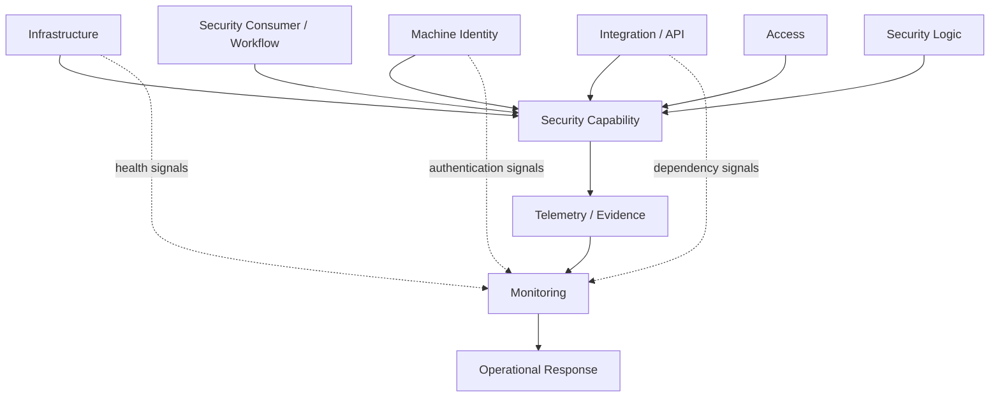
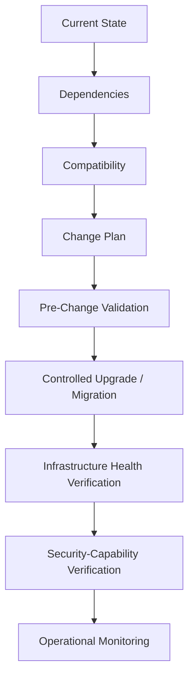
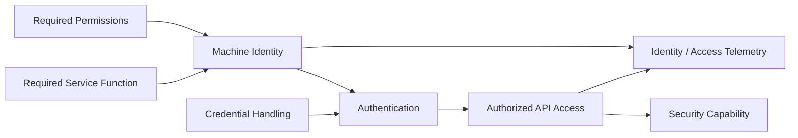
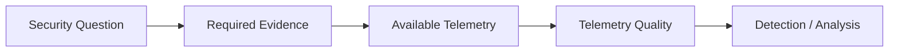
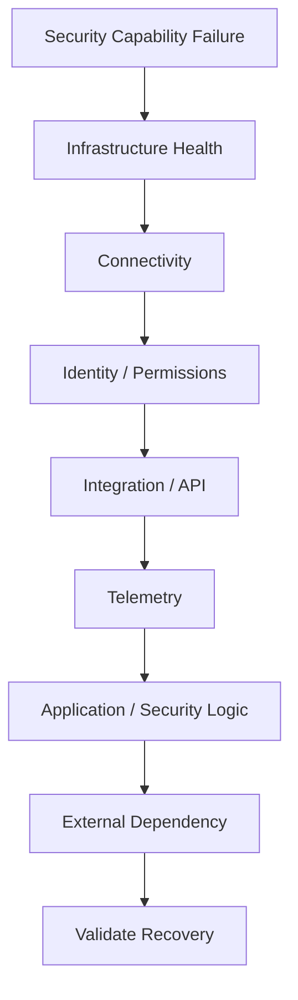
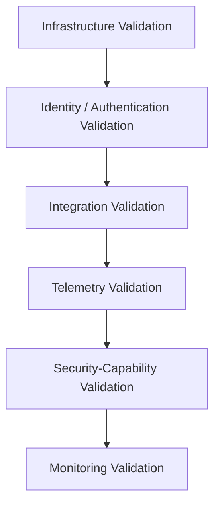

# Cloud Security Infrastructure as a Production System

> Operating cloud-hosted security capabilities requires more than security logic. The infrastructure, identities, telemetry, integrations, availability, and failure behavior supporting the control must also be engineered.

> **Ownership:** Professional Experience  
> **Implementation Status:** Implemented professional experience / Generalized public methodologies  
> **Disclosure:** Showcase / Clean-Room  
> **Evidence:** Generalized experience summary / Independently authored models

## Problem

Security platforms are themselves production systems. A correct policy or detection does not make a capability operational when its infrastructure is unhealthy, telemetry is unavailable, machine identity fails, permissions change, integrations break, scanners become unhealthy, or an upgrade introduces incompatibility.

The capability depends on the complete system around its security logic:

> **Security Capability = Infrastructure + Identity + Access + Telemetry + Integration + Security Logic + Monitoring**

A failure in any layer can reduce coverage, remove context, delay analysis, or make the control unavailable. Security engineering therefore includes operating the systems that allow a control to function—not only defining the control itself.

## Professional Context

My professional experience includes hands-on engineering and operational work supporting cloud-hosted security infrastructure across AWS and GCP. The work has included platform operations, infrastructure migrations and upgrades, health assessment, patching, troubleshooting, availability support, telemetry, service accounts, APIs, integrations, and security-scanning infrastructure.

In AWS, this has included infrastructure supporting security-policy capabilities in database-security and data-exfiltration contexts. In GCP, it has included cloud-hosted and virtual scanner systems, BigQuery security-telemetry context, service identities, APIs, integrations, and cloud resources supporting security operations. I have also had hands-on exposure to Kubernetes and containers through containerized security-scanner infrastructure.

Ownership here is limited to hands-on engineering and operational responsibilities. This case study does not claim sole ownership of enterprise cloud architecture, organization-wide IAM, or an enterprise Kubernetes platform.

## Conceptual Architecture Model

**Status: CLEAN-ROOM CONCEPTUAL MODEL**

This model was independently created to show the dependency structure of a cloud-hosted security capability. It is not a reproduction of an employer architecture.

This representation separates the security outcome from the dependencies that support it. It also makes monitoring and operational response part of the capability rather than an afterthought.

## Cloud Security Infrastructure

My supported experience includes operating and supporting cloud-hosted security systems with attention to:

- infrastructure and platform health;
- availability and security-capability continuity;
- patching and upgrades;
- dependency and compatibility awareness;
- network and API connectivity;
- authentication and service-identity behavior;
- troubleshooting and operational support; and
- escalation and vendor coordination when resolution crossed team or product boundaries.

The central engineering concern is continuity of the security capability. A healthy server, service, or resource is necessary but may not be sufficient: the integration, identity, telemetry path, and security function must also work.

## Migration and Upgrade Thinking

**Status: GENERALIZED PROFESSIONAL METHODOLOGY — NOT A CLAIM OF A SPECIFIC EMPLOYER PROCESS**

The following model generalizes engineering reasoning informed by hands-on migration and upgrade experience. It does not assert that this exact formal lifecycle existed in a particular organization.

The distinction between the final verification layers matters. An infrastructure change is not complete merely because a server or service starts. The capability it supports must still authenticate, integrate, receive or produce the required telemetry, perform its security function, and expose failures through monitoring.

Without a supported project inventory, this case study intentionally does not publish a specific migration narrative, sequence, outcome, or scale.

## Machine Identity as a Security Boundary

> **Machine identity should be treated as a security boundary, not simply as an implementation detail.**

Service accounts and other workload identities determine what a security service can reach, which APIs it can call, and what evidence it can retrieve or process. Their design and operation affect both capability and exposure.

**Status: GENERALIZED MODEL informed by supported service-account and API-integration experience**

The engineering review should ask:

- What does the service need to do?
- Which machine identity performs that function?
- What permissions are required, and what is unnecessary?
- How does authentication occur, and how is credential material handled?
- Which APIs or integrations can the identity access?
- How does the capability behave when authentication or authorization fails?
- What telemetry shows use, failure, or unexpected behavior?
- What is the security impact if the identity is compromised?

This model does not disclose or imply real service-account names, permission sets, credentials, or organization-wide IAM ownership.

## Telemetry Fitness

Cloud telemetry is useful only when it can answer the security question being asked.

**A valid query cannot compensate for missing evidence.** Availability, completeness, attribution, timeliness, normalization, and retention all affect the confidence that can be placed in an analysis.

My supported GCP experience includes BigQuery in a security-telemetry and analytical context. This public treatment does not reproduce real datasets, queries, schemas, project identifiers, table names, or internal log sources. The deeper validation lifecycle is covered in [Detection Engineering & Validation](../detection-engineering-validation/README.md).

## Security-Scanning Infrastructure

My experience includes hands-on work with cloud-hosted and virtual security-scanner infrastructure. From an operational perspective, scanner effectiveness depends on more than scanner policy. Relevant engineering concerns include:

- infrastructure and scanner health;
- connectivity to the environments or services in scope;
- authentication and service identity;
- API and integration reliability;
- patching and upgrades;
- troubleshooting and escalation;
- monitoring and failure visibility; and
- continuity of the security coverage the scanner supports.

I have also had exposure to Kubernetes and containers through containerized scanner infrastructure. This is not a claim of enterprise cluster architecture, cluster-platform ownership, or Kubernetes security-program ownership.

## Troubleshooting Model

**Status: GENERALIZED PROFESSIONAL METHODOLOGY**

Troubleshooting a security capability requires tracing its dependency chain rather than assuming the policy or detection logic is broken.

The order is a diagnostic model, not a universal runbook. Real investigation can branch or revisit earlier layers. Its purpose is to prevent local application symptoms from hiding infrastructure, identity, integration, telemetry, or external-dependency failures.

Recovery validation should return to the original security capability: required evidence is available, the integration works, the control behaves as expected, and monitoring reflects the restored state.

## Failure Modes

| Failure mode | Potential security effect | Engineering response |
| --- | --- | --- |
| Infrastructure unavailable | Security capability becomes unavailable or degraded | Restore platform health, identify dependency impact, and validate capability recovery |
| Service-identity failure | An integration cannot retrieve or process required evidence | Validate authentication, authorization, identity state, and degraded behavior |
| Permission change | Capability is lost explicitly or silently | Compare required access with observed behavior and make authorization failures visible |
| Telemetry interruption | Detection or analysis develops a blind spot | Assess evidence loss, restore the telemetry path, and validate completeness |
| Scanner unhealthy | Security coverage becomes incomplete | Diagnose infrastructure and scanner health, restore service, and verify supported coverage |
| API integration failure | Context becomes stale, partial, or unavailable | Trace authentication, connectivity, dependency health, and error handling |
| Upgrade incompatibility | Platform or security behavior degrades after change | Validate compatibility, control the change, and verify infrastructure and capability separately |
| Monitoring gap | A failure persists without operational visibility | Add or repair health signals and validate that failure and recovery are observable |

These responses are generalized engineering approaches. They do not describe a specific employer incident or runbook.

## Layered Validation

**Healthy infrastructure does not automatically mean a healthy security control.** Validation should establish health at multiple layers.

| Validation layer | Evidence sought |
| --- | --- |
| Infrastructure | Required resources and services are available and healthy |
| Identity and authentication | The intended machine identity can authenticate as expected |
| Integration | Required API or system interactions complete and expose failures |
| Telemetry | Required evidence arrives with usable completeness and context |
| Security capability | The supported policy, scan, detection, or analysis function behaves as intended |
| Monitoring | Degradation and recovery are visible to the responsible operators |

This is a generalized validation model rather than a claim that one historical implementation used these exact gates.

## Operational Ownership

**Status: GENERALIZED OPERATIONAL MODEL informed by supported professional responsibilities**

Operating security infrastructure includes recurring responsibilities such as health monitoring, troubleshooting, patching, upgrades, dependency awareness, change validation, documentation, vendor escalation, and continuity of the supported security control.

These responsibilities are collaborative. Platform teams, security engineers, service owners, vendors, identity owners, and data or telemetry owners may each hold part of the dependency chain. Effective ownership means knowing the boundary of one's responsibility, retaining enough evidence to diagnose failures, and escalating with useful technical context when resolution crosses that boundary.

## AWS, GCP, and Container Context

| Context | Supported experience |
| --- | --- |
| AWS | Cloud-hosted security-platform operations, infrastructure support, migrations and upgrades, health, patching, troubleshooting, availability support, and security-policy infrastructure context |
| GCP | Security-scanning infrastructure, virtual scanners, cloud resources supporting security operations, telemetry and data workflows, service identities, APIs, and integrations |
| BigQuery | Security-telemetry and analytical context |
| Kubernetes and containers | Exposure through containerized security-scanner infrastructure; no enterprise platform-ownership claim |

This is an experience boundary, not a certification inventory or claim of sole ownership.

## Engineering Decisions Informed by This Work

This experience informs how I reason about:

- where a cloud-hosted security capability can fail;
- what evidence distinguishes infrastructure health from control health;
- how machine identity affects both capability and exposure;
- how compatibility and upgrades can affect security controls;
- how telemetry availability limits security confidence;
- how to validate infrastructure and control behavior separately;
- when a failure crosses an ownership boundary and requires escalation; and
- why operational health is itself a security concern.

These are generalized decision areas. No unsupported historical outcome or specific employer decision is implied.

## Evidence and Disclosure Classification

### PROFESSIONAL EXPERIENCE

- AWS and GCP security infrastructure
- Cloud-hosted security-platform operations and support
- Infrastructure migrations and upgrades
- Platform health, patching, troubleshooting, and availability support
- Security telemetry and BigQuery analytical context
- Service accounts, APIs, and integrations
- Cloud-hosted and virtual scanner infrastructure
- Kubernetes and container exposure through security-scanner infrastructure
- Escalation and vendor coordination

### PUBLIC CLEAN-ROOM EVIDENCE

- Independently authored conceptual architecture model
- Generalized migration and upgrade methodology
- Machine-identity boundary model
- Telemetry-fitness model
- Generalized troubleshooting methodology
- Generic failure-mode analysis
- Layered validation model

### PRIVATE

- Employer architecture and proprietary system names
- Cloud account, project, resource, and service-account identifiers
- Hostnames, IP addresses, and network details
- Credentials, permissions, and proprietary configuration
- Internal telemetry, BigQuery queries, datasets, schemas, and table names
- Scanner configuration and internal runbooks
- Screenshots, incident details, and employer-specific operating procedures

## What I Learned

- Security infrastructure has production-system dependencies.
- Machine identity is part of the security boundary.
- Telemetry availability constrains security confidence.
- Infrastructure health and security-control health are related but distinct.
- Migrations require capability validation, not only infrastructure validation.
- Troubleshooting requires dependency-chain reasoning.
- Security tools themselves require observability and operational ownership.

## Disclosure

This case study presents generalized engineering methods derived from professional cloud-security experience. All diagrams and models were independently created from first principles for this portfolio.

No employer architecture, credentials, telemetry, cloud identifiers, queries, configurations, screenshots, incident details, or proprietary implementation is reproduced.
