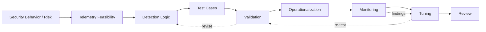
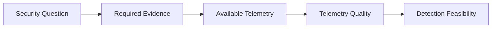
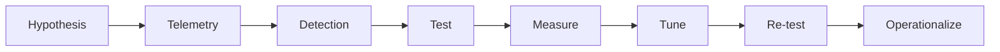
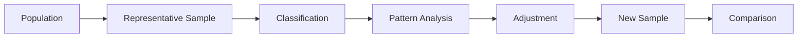
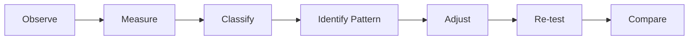

# Detection Engineering & Validation

> Engineering detections as measurable security controls—from telemetry feasibility through validation, tuning, operationalization, and ongoing review.

> **Ownership:** Professional Methodology  
> **Implementation Status:** Implemented through professional security-engineering work  
> **Disclosure:** Showcase / Clean-Room  
> **Evidence:** Independently recreated methodology / Synthetic public example

## Signal path // quick read

> **The question:** Can the available evidence support the behavior we want to detect—and will the result help an analyst make a decision?

- Start with a security hypothesis, not a query.
- Test telemetry fitness before trusting detection logic.
- Validate positive, negative, ambiguous, and failure cases.
- Measure representative samples before tuning.
- Give the control ownership, monitoring, review, and retirement criteria.

**Public proof:** clean-room lifecycle models and an eight-event fictional validation exercise. Employer rules, telemetry, and metrics remain private.

[Follow the lifecycle](#detection-engineering-lifecycle) · [See the validation method](#validation-method) · [Inspect the synthetic example](#synthetic-validation-example)

## Problem

Detection engineering often begins with the wrong question:

> What query should we write?

The more useful starting point is:

> What behavior are we trying to detect, and can the available telemetry provide the evidence required to detect it?

A query can be syntactically correct and still produce a weak security control. Noisy telemetry, incomplete identity context, brittle conditions, expected business behavior, and missing evidence can create excessive false positives or leave meaningful gaps. The result may technically fire while providing little investigative value, eroding analyst trust and increasing avoidable work.

A detection is not complete when a query returns results. It becomes an operational security control when its intent, evidence, behavior, failure modes, quality, ownership, and lifecycle are understood.

## Why It Matters

Detection quality shapes investigation workload, response confidence, coverage, analyst efficiency, and operational trust. It affects whether analysts can distinguish meaningful security behavior from routine activity and whether the absence of an alert means anything defensible.

This is why detection engineering must account for more than matching logic. Telemetry fitness, validation evidence, investigative context, deployment behavior, monitoring, tuning, and eventual retirement are all part of the control.

## My Role and Ownership

This methodology reflects professional security-engineering experience. I have designed, tuned, validated, and operationalized detections and security controls involving user activity, data movement, privileged activity, insider-risk behaviors, telemetry analysis, coverage expansion, and investigation workflows.

That work has involved collaboration with analysts, data owners, platform teams, and other control stakeholders. This page does not imply sole ownership of an employer-wide detection program. The public material is an independently authored methodology; no employer detection, telemetry, query, metric, workflow, or artifact is reproduced.

## Detection Engineering Lifecycle

| Stage | Engineering question |
| --- | --- |
| Security behavior or risk | What observable behavior represents the security concern? |
| Telemetry feasibility | Does the evidence exist, and is it reliable enough to support the hypothesis? |
| Detection logic | How should the available evidence represent the behavior without encoding unnecessary assumptions? |
| Test cases | What should match, what should not match, and which cases should remain explicitly unresolved? |
| Validation | Does the control behave as intended across positive, negative, historical, and failure cases? |
| Operationalization | Who owns the control, what context reaches the analyst, and how is it released? |
| Monitoring | Is the control still receiving suitable telemetry and producing useful evidence? |
| Tuning | What measured pattern justifies a change, and what behavior must the change preserve? |
| Review | Does the control still address a current risk, or should it be revised or retired? |

The lifecycle is iterative. Validation can send a design back to detection logic; monitoring provides the evidence for tuning; and every tuning change returns to validation before operational use.

## Telemetry Fitness

**A valid query cannot compensate for missing evidence.**

Before designing detection logic, I evaluate whether the telemetry can support the security hypothesis. Relevant questions include:

- Are the required fields present and populated consistently?
- Can activity be attributed to the relevant identity or entity?
- Are event timestamps trustworthy and comparable across sources?
- Is the event population complete enough for the intended conclusion?
- Is normalization preserving the distinctions needed by the control?
- How reliable is the source, and how are source failures exposed?
- Is the context needed to distinguish expected behavior available?
- Does ingestion latency affect when or whether the behavior can be identified?

The output may be a feasible detection, a narrower hypothesis, a telemetry-improvement requirement, or a documented gap. Treating all four as legitimate outcomes prevents weak evidence from being disguised as confident detection logic.

## Detection Design

Detection design begins with a behavioral hypothesis rather than a product syntax. A generic example might be:

> We want to identify an unusual pattern of sensitive-data movement.

The design process then asks:

- What observable evidence should the behavior produce?
- What does relevant normal activity look like?
- Which identity, asset, application, or workflow context changes interpretation?
- Which circumstances increase concern?
- Which legitimate workflows may resemble the behavior?
- What evidence will an analyst need after the control fires?
- What missing evidence prevents a defensible conclusion?

This framing keeps the behavior separate from any one query language or platform. Exact conditions, production logic, thresholds, and schemas are intentionally outside this public methodology.

## Validation Method

Validation combines several forms of evidence:

- **Positive testing:** representative behavior expected to match is detected.
- **Negative testing:** legitimate or irrelevant behavior expected not to match remains excluded.
- **Historical telemetry review:** past events are examined for prevalence, context, and unexpected patterns without treating history as ground truth by itself.
- **Representative sampling:** a larger population is sampled and classified systematically.
- **Known-event validation:** events with independently understood context are used to check expected behavior.
- **Analyst review:** alert evidence is assessed for investigative usefulness and ambiguity.
- **Iterative tuning:** measured patterns drive a change, followed by re-testing.
- **Before-and-after comparison:** the revised control is compared with its earlier behavior using the same evaluation frame.

Validation should include missing-field, stale-context, and source-failure cases—not only ideal positive matches.

## Quantitative Sampling

Large alert or event populations should not be tuned from a few memorable examples. Representative sampling provides a repeatable way to measure what is occurring without requiring every event to be reviewed at once.

A sample can be classified into categories such as:

- meaningful security signal;
- expected business behavior;
- telemetry noise;
- insufficient context; or
- control gap.

Sampling design should consider relevant population segments and potential bias. Classification criteria should be documented, ambiguous cases should remain visible, and a changed control should be evaluated with a new sample using a comparable method.

The principle is straightforward: do not tune solely from anecdotal analyst frustration. Measure the problem. This portfolio does not publish employer sample sizes, false-positive rates, or historical improvement metrics.

## Synthetic Validation Example

**Status: SYNTHETIC / INDEPENDENTLY CREATED**

The following fictional events demonstrate validation reasoning for a hypothetical sensitive-data-movement behavior. They are not employer telemetry, a production schema, or deployable detection logic.

| Event | Fictional entity | Generic category | Synthetic context | Validation expectation |
| --- | --- | --- | --- | --- |
| E-01 | `demo-user-017` | authentication | Routine access with expected identity context | Expected negative |
| E-02 | `demo-user-017` | file access | Ordinary access within an expected work activity | Expected negative |
| E-03 | `demo-user-042` | application activity | Approved bulk workflow is documented in context | Expected negative |
| E-04 | `demo-user-042` | file access | Access to a fictional sensitive collection begins | Sequence evidence |
| E-05 | `demo-user-042` | data transfer | Transfer follows E-04 and available context does not explain it | Expected positive for review |
| E-06 | `demo-admin-003` | privileged action | Approved maintenance context is present | Expected negative |
| E-07 | `demo-user-017` | authentication | Activity appears unusual, but device context is unavailable | Ambiguous / context dependent |
| E-08 | `demo-user-017` | data transfer | Destination classification required for interpretation is missing | Missing-evidence case |

The validation exercise asks whether the hypothetical control:

- identifies the E-04/E-05 pattern for analyst review;
- preserves the documented expected workflows in E-01 through E-03 and E-06;
- avoids presenting E-07 as conclusive without the missing context; and
- makes the evidence gap in E-08 visible instead of silently treating the event as safe or suspicious.

The example intentionally avoids specifying timing windows, quantities, thresholds, field names, scoring, or query conditions. Its purpose is to show positive, negative, ambiguous, and missing-evidence test design.

## Detection Quality

**Alert volume is not a detection-quality metric.** A low-volume control can be irrelevant, while a higher-volume control may be appropriate if its evidence is meaningful and actionable.

I evaluate detection quality across several dimensions:

| Dimension | Question |
| --- | --- |
| Behavioral relevance | Does the control still represent the behavior it was designed to identify? |
| Evidence quality | Is the conclusion supported by complete, reliable, attributable evidence? |
| Investigative usefulness | Does the result give an analyst enough context to decide what to do next? |
| Expected-behavior handling | Are legitimate workflows understood without hiding meaningful variants? |
| Explainability | Can a reviewer understand why the control fired and what evidence mattered? |
| Coverage | Which parts of the hypothesis are observable, and which remain gaps? |
| Repeatability | Can validation be rerun and compared after a change? |
| Maintainability | Can the control survive understandable platform, schema, and business changes? |
| Failure visibility | Will telemetry or enrichment failure be evident rather than silently reducing coverage? |

These dimensions are an evaluation framework, not a numeric scoring formula.

## Tuning

The goal of tuning is not simply fewer alerts. The goal is better signal while preserving the behavior the control was designed to identify.

A defensible tuning change starts with observed evidence, measures and classifies the issue, identifies a repeatable pattern, and adjusts the smallest appropriate part of the control or its context. The revised behavior is then re-tested against positive, negative, ambiguous, and failure cases before comparison with the prior version.

Sometimes the correct response is not a detection-logic change. The evidence may instead support telemetry repair, improved context, workflow documentation, investigation guidance, or acceptance of a known limitation.

## Operationalization

Validation is not the end of the lifecycle. An operational detection needs:

- an identified owner;
- documented intent and scope;
- controlled deployment or release;
- analyst-facing evidence and context;
- clear escalation expectations;
- monitoring for telemetry and behavior changes;
- defined triggers for tuning;
- periodic review; and
- retirement when the risk, evidence, or control is no longer valid.

These responsibilities describe a general engineering method, not a specific employer workflow. The operating model should make it possible to answer who owns a control, why it exists, what evidence supports it, when it last changed, and what would cause it to be reconsidered.

## Failure Modes

| Failure mode | Potential effect | Engineering response |
| --- | --- | --- |
| Missing telemetry | The control cannot establish required evidence | Expose the gap, assess coverage impact, and repair the source or narrow the claim |
| Identity mismatch | Activity is attributed to the wrong entity | Validate identity mapping and retain attribution uncertainty in the result |
| Schema change | Logic silently stops matching or changes meaning | Monitor field availability and validate after source or parser changes |
| Business-process change | Newly expected behavior begins triggering | Measure the new pattern, update context, and re-test before tuning |
| Over-tuning | Meaningful behavior is suppressed with unwanted noise | Re-run positive and negative cases and compare behavior with the prior version |
| Context-source failure | An alert loses explanatory or investigative value | Make enrichment failure visible and define degraded behavior |
| Control never reviewed | A stale control persists without current evidence | Assign ownership, a review trigger, and retirement criteria |

## Governance as Engineering

Detection governance should preserve the reasoning and evidence needed to operate a control, not merely record that a review occurred. Useful artifacts include:

- documented behavioral intent;
- explicit telemetry requirements and known gaps;
- positive, negative, ambiguous, and failure test evidence;
- review of material logic or context changes;
- controlled deployment records;
- monitoring expectations;
- tuning rationale and history;
- exception handling where applicable;
- periodic reassessment; and
- retirement decisions.

This makes the control explainable over time. A future engineer or analyst should be able to understand what the detection is meant to establish, what evidence it depends on, how its behavior was tested, and where its known limits remain.

<strong>Evidence map // professional, public, private</strong>

## Evidence and Disclosure Classification

### PROFESSIONAL EXPERIENCE

- Detection design and telemetry analysis
- Positive, negative, historical, and failure-oriented validation
- Quantitative sampling and evidence-based tuning
- Operationalization and investigation-workflow support
- Coverage analysis and expansion

### PUBLIC CLEAN-ROOM EVIDENCE

- Independently authored lifecycle diagrams
- Synthetic validation example with fictional entities and events
- Generic failure-mode analysis
- Validation and quantitative-sampling methodology
- Telemetry-fitness framework
- Detection-quality dimensions

### PRIVATE

- Employer detection rules and production queries
- Employer telemetry and internal schemas
- Internal tools, documents, and screenshots
- Employee, customer, account, and incident information
- Internal metrics and historical results
- Employer-specific thresholds, workflows, and implementation details

## What I Learned

- Telemetry quality constrains detection quality.
- Missing evidence should be visible rather than silently ignored.
- False positives should be measured rather than discussed only anecdotally.
- Tuning should preserve behavioral intent, not merely reduce volume.
- Validation should include negative, ambiguous, and failure cases.
- Detections need lifecycle ownership, monitoring, reassessment, and retirement.
- Investigation usefulness is part of detection quality.
- A detection is an engineered security control, not merely a query.

## Disclosure

This case study describes a generalized engineering methodology derived from professional experience. All public examples, events, diagrams, and workflows were independently created from first principles for this portfolio.

No employer detection logic, telemetry, queries, internal tooling, schemas, metrics, incidents, or proprietary implementation is reproduced. The synthetic example is fictional and is not presented as an employer artifact or production control.
